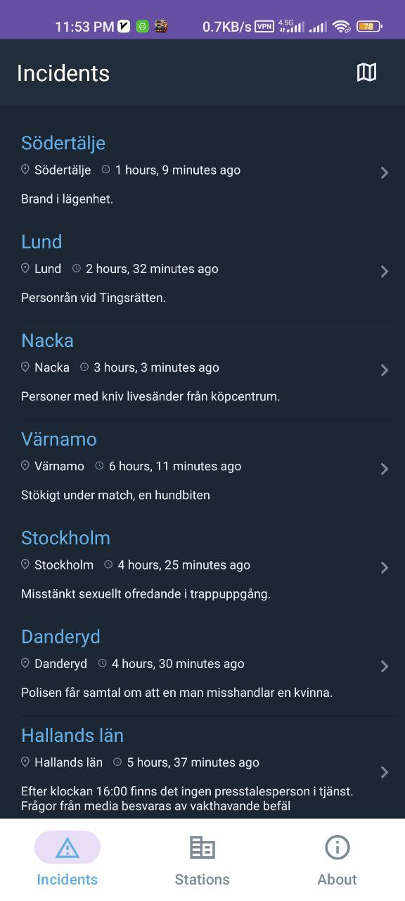

# Sweden Police Assistance App

CrimeTracker is an Android Kotlin application designed for the Swedish Police to efficiently manage and respond to crimes. This app enables precise crime location tracking, allows users to report crimes, and displays police stations on an interactive map.

## Features

- **Crime Location Tracking:** Pinpoints exact crime locations for swift police response.
- **Crime Reporting:** Citizens can easily report crimes, enhancing community engagement.
- **Police Stations Map:** Displays nearby police stations on an interactive map.
- **Intuitive Interface:** User-friendly design for seamless navigation.

## Installation and Execution

[Download APK](https://raw.githubusercontent.com/vakiliali79/Sweden-Police-Assistance-Android/master/Sweden-Police.apk)

To install and run the CrimeTracker app, follow these steps:

1. Clone the project:
   ```bash
   git clone https://github.com/vakiliali79/Sweden-Police-Assistance-Android.git
   ```

2. Open the project in Android Studio.

3. Run the application on an Android emulator or a physical device.

## Usage

1. Open the app.
2. Report crimes with precise locations for immediate police attention.
3. Explore nearby police stations on the map.
4. Navigate through the app's intuitive interface for seamless interaction.

## Technologies Used

- Kotlin
- Android Studio
- Google Maps API (for map functionality)
- https://polisen.se/en/ API


## Screenshots:

- **Screenshot 1**:

  

- **Screenshot 2**:

  

- **Screenshot 3**:

  
